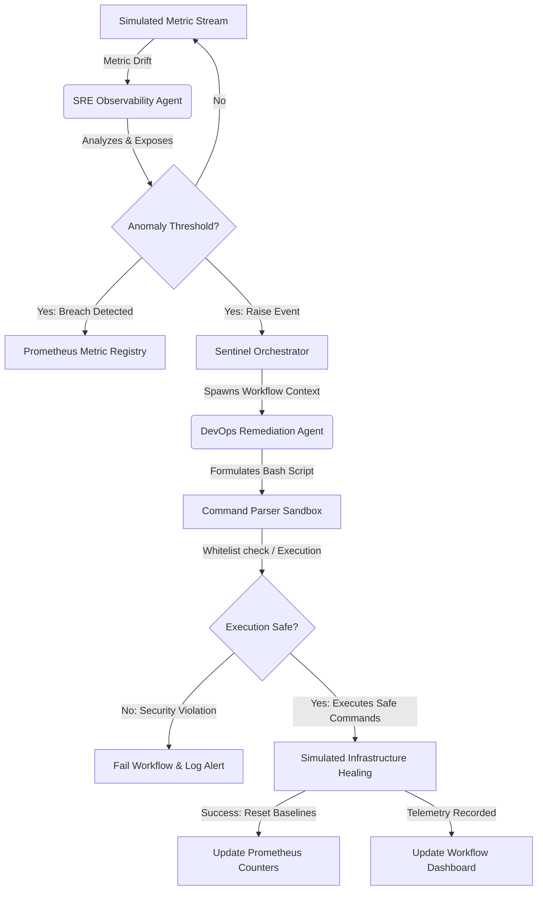

# SentinelAI: Multi-Agent Autonomous Infrastructure Recovery

SentinelAI is an enterprise-grade, asynchronous multi-agent system built to automate SRE observability and DevOps self-healing remediation. It simulates continuous log and metrics monitoring, flags critical infrastructure anomalies, and autonomously resolves them within a secure sandbox environment.

## System Architecture

The workflow leverages native Python `asyncio` routines to drive concurrent, event-based collaboration between specialised agents:



## Agents Definition

1. **SRE_Observability_Agent**
   - Continuously monitors infrastructure streams (CPU, Memory, Disk, DB error rate).
   - Updates Prometheus metric states (`sentinel_system_cpu_usage_ratio`, etc.).
   - Registers occurrences to `sentinel_anomalies_detected_total`.

2. **DevOps_Remediation_Agent**
   - Receives target resource contexts and formulates corresponding bash execution scripts.
   - Executes routines via a `SecureSandbox` that restricts commands to an approved whitelist and blocks dangerous operators (e.g. `rm -rf /`, `curl`, `sudo`).
   - Increments the execution metrics counter (`sentinel_remediations_triggered_total`).

---

## Getting Started Locally

### 1. Native Python Run
```bash
# Install dependencies
pip install -r requirements.txt

# Start the application
python -m src.main
```
Access the dashboard at [http://localhost:8000/](http://localhost:8000/).

### 2. Docker Compose Orchestration (Recommended)
This runs the application alongside a local Prometheus server that automatically scrapes the telemetry metrics.

```bash
# Build and run containers
docker-compose up --build -d
```

- **Interactive Dashboard**: [http://localhost:8000/](http://localhost:8000/)
- **Prometheus UI**: [http://localhost:9090/](http://localhost:9090/)

---

## Production Readiness & API Endpoints

- **`/`**: Rich interactive dashboard to view system health, trigger/inject anomalies, and watch agent workflows in real-time.
- **`/metrics`**: Exposes Prometheus-compatible metrics.
- **`/healthz`**: Kubernetes liveness and readiness probe (returns `200 OK` or `503 Service Unavailable`).
- **`/workflows`**: JSON dump of running and completed self-healing runs.
- **`/inject?anomaly_type=<cpu|memory|disk|db_errors>`**: Force triggers an anomaly for demo purposes.

---

## Enterprise Deployment Manifests

The Kubernetes configuration is defined in the `k8s/` folder:
- [Deployment Manifest](file:///D:/Madhav/sentinelAI/k8s/deployment.yaml)
- [Service Manifest](file:///D:/Madhav/sentinelAI/k8s/service.yaml)
